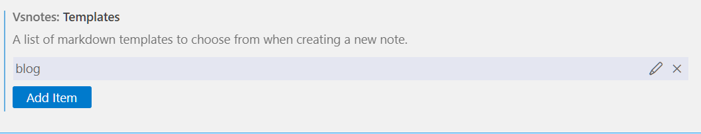

## VSNOTE

### install extension
- vsNotes(https://marketplace.visualstudio.com/items?itemName=patricklee.vsnotes)

### Create Snippet 
Template(https://code.visualstudio.com/docs/editor/userdefinedsnippets) markdown.json에 snippet 추가

```md
{
	"vsnote_template_blog": {
		"prefix": "vsnote_template_blog",
		"body": [
			"---",
			"hide_table_of_contents: false",
			"title: ${TM_FILENAME_BASE}",
			"directory: ${TM_DIRECTORY/^.+\\\\(.*)$/$1/}",
			"date: $CURRENT_YEAR-$CURRENT_MONTH-$CURRENT_DATE $CURRENT_HOUR:$CURRENT_MINUTE:$CURRENT_SECOND",
			"authors: ysyoo",
			"tags:",
			" - note",
			"---",
            "\n# $1",
			"",
			"## content1",
		]
	}
}
```

```md
"vsnotes.noteTitleConvertSpaces": " ",
"vsnotes.defaultNoteTitle": "{dt}-{title}.{ext}",   // '{dt}-{title}' 형태로 변경
"vsnotes.tokens": [
  {
    "type": "datetime",
    "token": "{dt}",
    "format": "YYYY-MM-DD",                         // 'YYYY-MM-DD' 형태로 변경
    "description": "Insert formatted datetime."
  },
  {
    "type": "title",
    "token": "{title}",
    "description": "Insert note title from input box.",
    "format": "Untitled"
  },
  {
    "type": "extension",
    "token": "{ext}",
    "description": "Insert file extension.",
    "format": "md"
  }
],
```

- ref (https://blog.chick-p.work/blog/vsnote-template)

### settings 수정
#### 사용할 디렉토리 설정
setting > preference > vsNotes > vsnotes: Default Note Path 에 디렉토리(절대경로) 넣기

- ref (https://qiita.com/ysmb-wtsg/items/6863d853174b46f9dc34)

#### snippet 지정


## Docusaurus